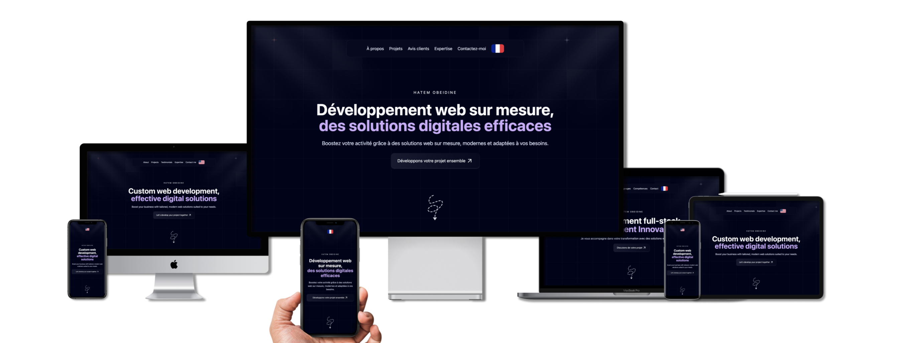

# 🌐 Personal Portfolio - [callhatem.fr](https://callhatem.fr)



Welcome to my personal portfolio, designed as a modern and responsive landing page. It highlights my skills, projects, and services as a full-stack developer. 🌟
## 🛠️ Technologies Used

The project uses <a href="https://nuxt.com">NuxtJS </a> and <a href="https://tailwindcss.com">TailwindCSS </a> for a modern and efficient development process.

## 🌍 Features

- **Modern Landing Page**: Clean and user-friendly design.
- **Multilingual**: Available in French 🇫🇷 and English 🇬🇧.
- **Responsive**: Optimized for all devices (mobile, tablet, desktop).

## 🖌️ Inspiration

The design of this portfolio is inspired by numerous open-source projects found on Figma. A big thanks to everyone who freely shares their ideas and creations. 🙌

## 📂 Installation and Setup

To run this project locally, follow these steps:

1. Clone the repository:
   ```bash
   git https://github.com/ouaischatem/callhatem.fr
   cd your-repo
   ```
2. Install dependencies: :
   ```bash
   npm install
   ```
3. Start the local server:
   ```bash
    npm run dev
   ```
4. Open your browser and navigate to:
   ```bash
    http://localhost:3000
   ```
   
## 📜 Licence

This project is open-source under the MIT License. You are free to use, modify, and adapt it as needed. However, please credit the author (Hatem Obeidine) as the original contributor.

## 📧 Contact

Have questions or want to collaborate? Feel free to reach out:

- **[Email](mailto:contact@callhatem.fr)** : contact@callhatem.fr
- **[Portfolio](https://callhatem.fr)** : callhatem.fr
- **[LinkedIn](https://www.linkedin.com/in/hatemobeidine/)** : Hatem Obeidine